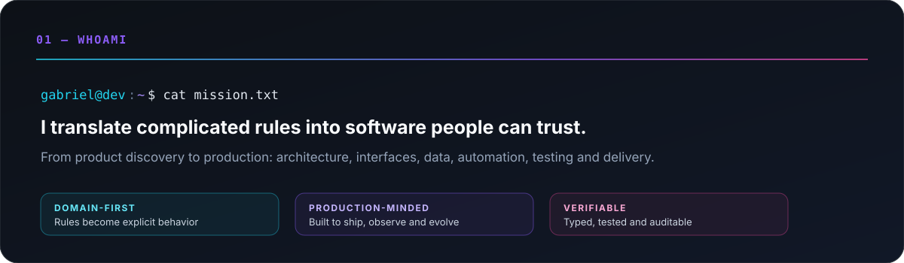
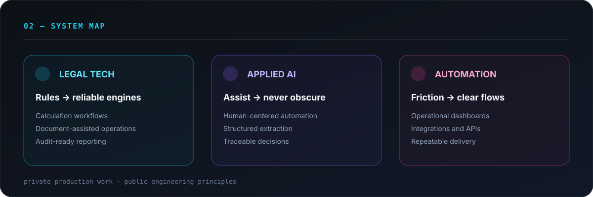
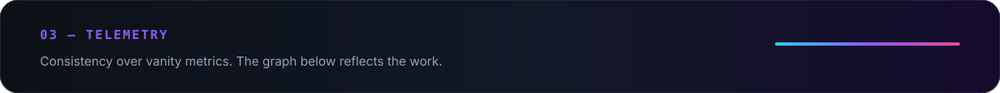
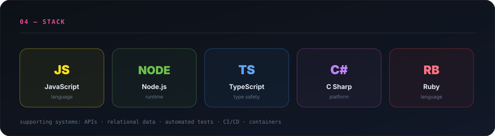

<picture>
  <source media="(prefers-color-scheme: dark)" srcset="https://github-readme-activity-graph.vercel.app/graph?username=GabrielMilkovich&bg_color=00000000&color=e2e8f0&line=8b5cf6&point=22d3ee&area_color=7c3aed&area=true&hide_border=true&radius=8&custom_title=CONTRIBUTION%20TELEMETRY" />
  
</picture>

